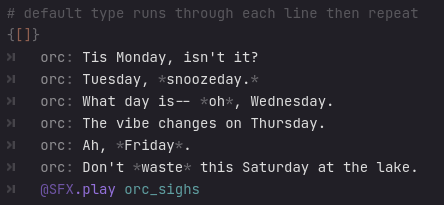
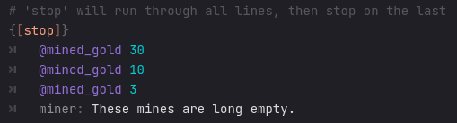
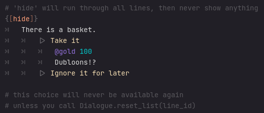
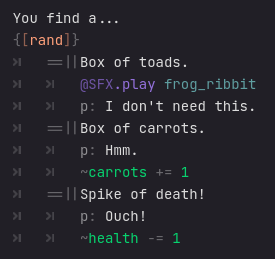
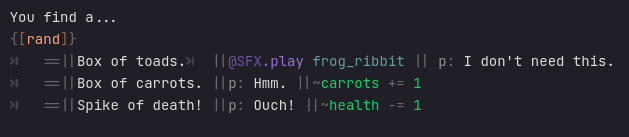
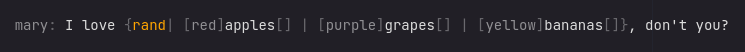

# Lists
{: .no_toc }

## Table of contents
{: .no_toc .text-delta }

1. TOC
{:toc}

## Lists

Lists display only one of their items per visit.

They are a way of introducing more randomness and diversity to a common bit of dialogue.

### In flow

<!--  -->



```
# default type runs through each line then repeat
{[]}
    orc: Tis Monday, isn't it?
    orc: Tuesday, *snoozeday.*
    orc: What day is-- *oh*, Wednesday.
    orc: The vibe changes on Thursday.
    orc: Ah, *Friday*.
    orc: Don't *waste* this Saturday at the lake.
    @SFX.play orc_sighs
```

```
# 'rand' type picks a line at random.
{[rand]}
    orc: Greetings.
    orc: Hello.
    orc: Nice day, isn't it?
```



```
# 'stop' will run through all lines, then stop on the last
{[stop]}
    @mined_gold 30
    @mined_gold 10
    @mined_gold 3
    miner: These mines are long empty.
```



```
# 'hide' will run through all lines, then never show anything
{[hide]}
    There is a basket.
        |> Take it
            @gold 100
            Dubloons!?
        |> Ignore it for later

# this choice will never be available again
# unless you call Dialogue.reset_list(line_id)
```


#### Multiple steps
To include multiple steps in a list item, use the inline `==`.
```
You find a...
{[rand]}
    ==
        Box of toads.
        @SFX.play frog_ribbit
        p: I don't need this.
    ==
        Box of carrots.
        p: Hmm.
        ~carrots += 1
    ==
        Spike of death!
        p: Ouch!
        ~health -= 1
```
The `||` pattern may be handy: it inserts tabbed lines from the current one.



```
You find a...
{[rand]}
    ==||Box of toads.
        @SFX.play frog_ribbit
        p: I don't need this.
    ==||Box of carrots.
        p: Hmm.
        ~carrots += 1
    ==||Spike of death!
        p: Ouch!
        ~health -= 1
```
You can do it all one line, but I think it's messy.



```
You find a...
{[rand]}
    ==||Box of toads.||@SFX.play frog_ribbit||p: I don't need this.
    ==||Box of carrots.||p: Hmm.||~carrots += 1
    ==||Spike of death!||p: Ouch!||~health -= 1
```

### In text
Text can have lists by using the pattern:
```
{list_type|item1|item2|item3|item4}
```

Whitespace between items is trimmed, but whitespace outside is kept.

```
mary: I love {rand| [red]apples[] | [purple]grapes[] | [yellow]bananas[]}, don't you?
```

It works in the speaker tag:
```
{rand|npc1|npc2|npc3}: {rand|Hello.|Fine day?|Out of my way!}
```

#### Nesting
Nesting is not yet supported, but I'll get around to it.

<!--  -->
