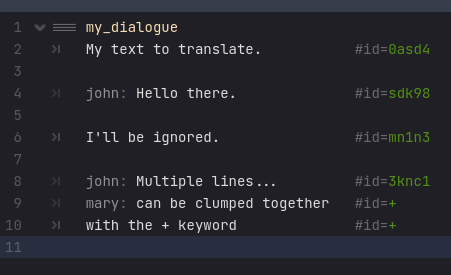
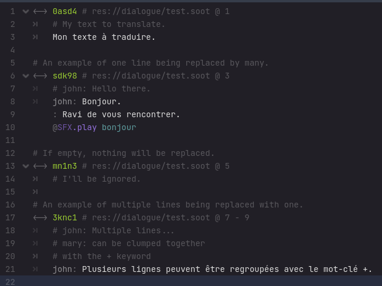
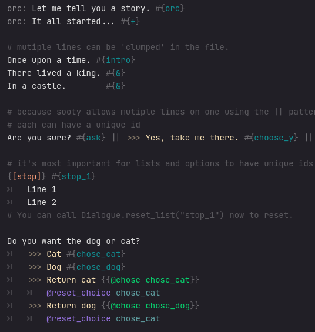

# Translation files `*.sola`
{: .no_toc }

## Table of contents
{: .no_toc .text-delta }

1. TOC
{:toc}

## About
**So**oty **La**nguage files `*.sola` are for translating or modifying lines in existing dialogue files `*.soot`.

## Generating



## Writing

Line ids look like `#{id}` at the end of a line.

Where they don't exist, they'll be auto generated.

There are some special tags:
```
# #{&}
# will copy the id of the last line id, but add a number to the end.
My text with an id.           #{my_line}
Another line with similar id. #{&}
And another.                  #{&}

# #{+}
# will be joined together in the lang file.
My text with an id.           #{multiline}
Another line with similar id. #{+}
And another.                  #{+}
```

The generated `.sola` for this will look like:

```
<-> my_line
    # My text with an id.

<-> my_line_2
    # Another line with similar id.

<-> my_line_3
    # And another.

<-> multiline
    # My text with an id.
    # Another line with similar id.
    # And another.
```

## Installing

## Line ids

Line ids aren't just for translations, but for keeping track of choices, list states, and more.

The save system will probably bug out if you load a save game after modifying dialogue lines that don't have ids. So be sure to at least setup ids for choices and lists.

### Manually adding



<!--  -->
```
#file.soot

orc: Let me tell you a story. #{orc}
orc: It all started... #{+}

# mutiple lines can be 'clumped' in the file.
Once upon a time. #{intro}
There lived a king. #{&}
In a castle.        #{&}

# because sooty allows mutiple lines on one using the || pattern
# each can have a unique id
Are you sure? #{ask} || >>> Yes, take me there. #{choose_y} || >>> No, I could be wrong. #{choose_m}

# it's most important for lists and options to have unique ids
{<stop>} #{stop_1}
  Line 1
  Line 2
# You can call Dialogue.reset_list("stop_1") now to reset.

Do you want the dog or cat?
  >>> Cat #{chose_cat}
  >>> Dog #{chose_dog}
  >>> Return cat {{@chose chose_cat}}
      @reset_choice chose_cat
  >>> Return dog {{@chose chose_dog}}
      @reset_choice chose_cat
```
<!--  -->

### Auto generating

*To write*
